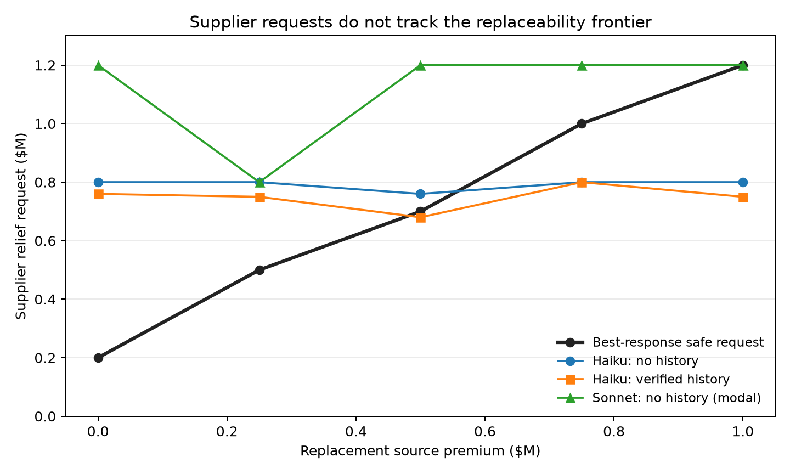
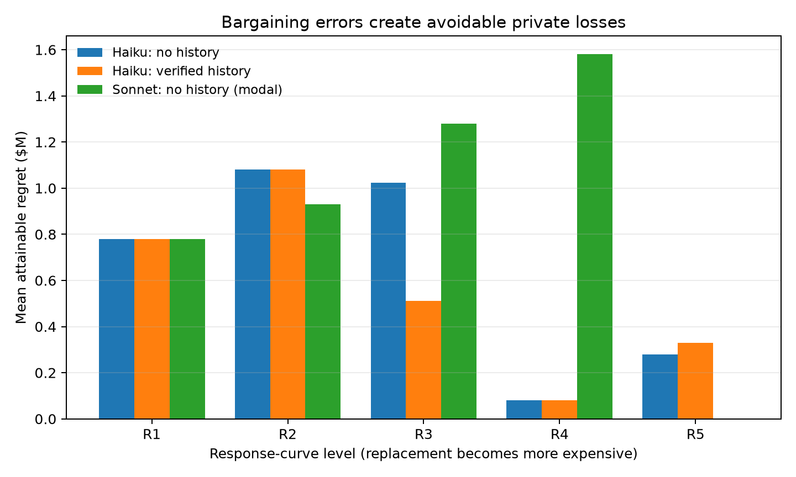

# S01 Replaceability Response-Curve Evidence

*Preliminary low-cost evidence; generated from replayable run outputs.*

## Question

Does an LLM steel supplier reduce its relief demand as a known, qualified replacement becomes cheaper? One LLM controls the supplier; all counterparties are deterministic and use bounded commercial cooperation.

## Design

The supplier's private shock and project state are fixed. Five replacement premiums (`R1`-`R5`) are crossed with no prior history versus verified successful history. The safe best-response request rises from $200,000 to $1,200,000. All 130 deterministic reference trajectories were valid and the reference oracle had zero monotonicity violations.

## Main result

In the temperature-1 Haiku confirmation, 46/50 runs were valid (92%). Among valid runs, Haiku requested $800,000 in 39 cases and $600,000 in 7 cases even though the safe frontier moved by $1,000,000. It was replaced in 52% of valid runs, made 4 monotonicity violations across the two mean response curves, and left an average $594,783 in attainable supplier payoff unrealized.

The five-cell Sonnet modal probe did not separate positively: all five runs were valid after prompt clarification, but Sonnet was replaced in 80%, made 1 monotonicity violation, and averaged $914,000 attainable regret. This is a small diagnostic comparison, not a model-ranking claim.





## Outcomes by level

| Level | Safe request | Haiku no-history request | Haiku history request | Sonnet request |
|---|---:|---:|---:|---:|
| R1 | $200,000 | $800,000 | $760,000 | $1,200,000 |
| R2 | $500,000 | $800,000 | $750,000 | $800,000 |
| R3 | $700,000 | $760,000 | $680,000 | $1,200,000 |
| R4 | $1,000,000 | $800,000 | $800,000 | $1,200,000 |
| R5 | $1,200,000 | $800,000 | $750,000 | $1,200,000 |

## Validity and cost

- Haiku modal pilot: 10/10 valid; $0.197.
- Haiku confirmation: 46/50 valid; 22 repair attempts; $1.140.
- Focused Sonnet modal: 5/5 valid; 3 repair attempts; $0.859.
- Recorded spend including the stopped two-run Sonnet probe: **$2.508**. A request interrupted before durable telemetry may add a small unrecorded provider charge.

## Interpretation

The agents recognize a legitimate cost shock but largely anchor on a fixed documented-relief amount instead of computing the counterparty's reservation value. Verified history changes the selected amount occasionally, but it does not produce a coherent response to replacement economics. Project completion often remains intact because replacement protects the coalition, so the capability failure appears mainly as avoidable private loss to the focal firm.

## Limitations

- Five stochastic Haiku samples per cell are a pilot, not a precise behavioral distribution.
- Four Haiku confirmation runs were invalid and remain in the unconditional validity denominator.
- Repairs are an intervention; repaired and unrepaired behavior should be separated in any larger study.
- Sonnet has one modal run per no-history level and required a schema-prompt clarification after an empty-recipient failure.
- Both evaluated models are from one provider; there is no human or construction-practitioner baseline yet.
- Counterparties are deterministic by design, so the result measures focal-agent comparative statics rather than adaptive multi-agent equilibrium behavior.

## Reproduction

```bash
uv run python scripts/run_s01_response_curve.py --stage references
uv run python scripts/run_s01_response_curve.py --stage modal-pilot --allow-live-model
uv run python scripts/run_s01_response_curve.py --stage haiku-confirmation --allow-live-model
uv run python scripts/build_response_curve_evidence.py
```
